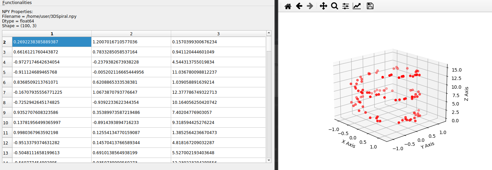
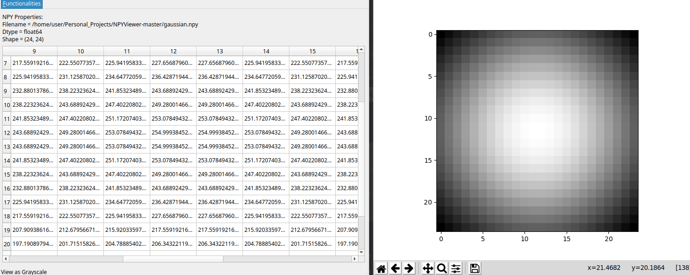
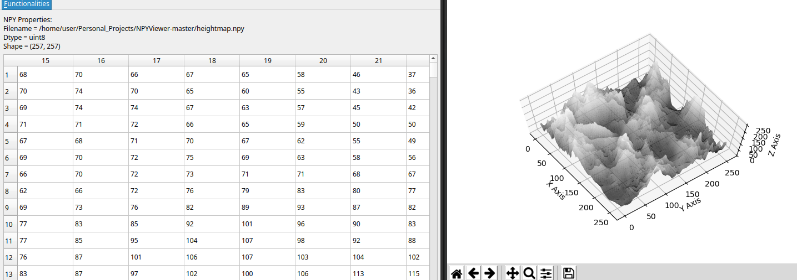
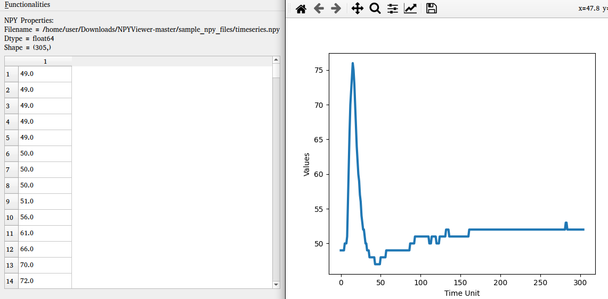
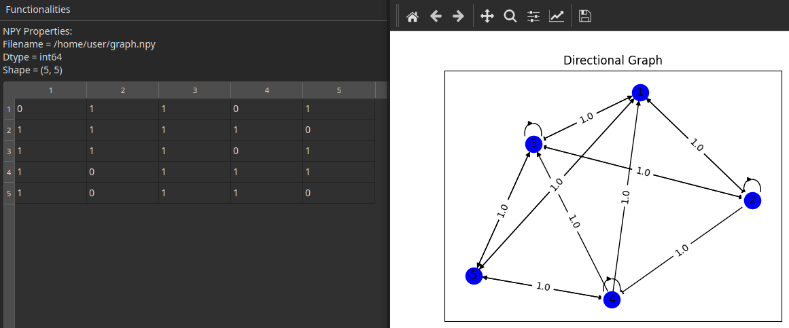
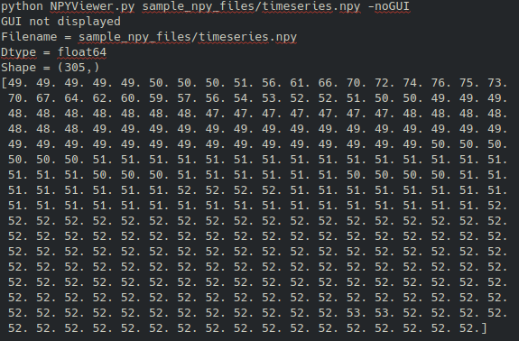

  

# NPYViewer 1.28
###  A simple GUI tool that provides multiple ways to load and view the contents of .npy files containing 2D and 1D NumPy arrays.

#### Plot 3-column 2D numpy arrays containing 3D coordinates as 3D point clouds

#### Plot 2D numpy arrays as grayscale images

#### Visualize heightmaps stored as 2D numpy arrays
 

#### Visualize timeseries data stored as 1D numpy arrays

#### Visualize adjacency matrices (saved in .npy arrays) as directional edge weighted graphs

#### Print numpy arrays in terminal

### Installation:
* Original development in Ubuntu 20.04 and Python 3.8.8
* Also tested on Windows 10 and Ubuntu 22.04
* pip3 install -r requirements.txt

### Execution:
* python3 NPYViewer.py

### Current Features:
* Open and view .npy files that contain 2D NumPy arrays and lists, as spreadsheets
* Convert .npy files to .csv format
* Convert .csv files to .npy format
* Export .npy files as .mat files (compatible with MATLAB and Octave)
* Plot 2D numpy arrays as grayscale images
* Plot 2D numpy arrays containing 3D coordinates as 3D point clouds
* Visualize heightmaps stored as 2D numpy arrays
* Visualize timeseries data stored as 1D numpy arrays
* Supports loading .npy files as command line arguments (e.g., python3 NPYViewer.py sample_npy_files/timeseries.npy)
* Visualize adjacency matrices (saved in .npy arrays) as directional edge weighted graphs
* Print numpy arrays in terminal through the use of the -noGUI argument (e.g., python NPYViewer.py sample_npy_files/timeseries.npy -noGUI)
* GUI developed using PyQT5

### TODO:
* Add/Remove Rows & Columns
* Copy/Paste Rows & Columns
* Data search and filtering
* Modify content datatypes 
* Handle data with more than 2 dimensions

### Changes since last version:
* Added application icon
* Fixed Bug: "View as TimeSeries" option was hidden in the "Functionalities" menu
