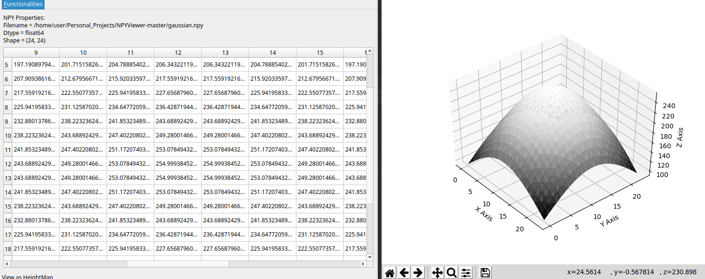

# NPYViewer 1.2
###  A simple GUI tool that provides multiple ways to view the contents of .npy files containing 2D NumPy Arrays 

#### Plot 3-column 2D numpy arrays containing 3D Coordinates as 3D Point Clouds

#### Plot 2D numpy arrays as Grayscale Images

#### Vizualize Heightmimport sys
from PyQt5.QtWidgets import *
from PyQt5.QtGui import QIcon
from PyQt5.QtCore import *
from pathlib import Path
import numpy as np
from numpy import asarray
from numpy import savetxt
import pandas as pd
import csv
from matplotlib import pyplot as plt
from mpl_toolkits.mplot3d import Axes3D

def isint(s):
    try:
        print(int(s))
        return True
    except ValueError:
        return False

def isfloat(s):
  try:
    print(float(s))
    return True
  except ValueError:
    return False

class NPYfile():
    def __init__(self,data,filename):
        self.data = data
        self.filename = filename
    def __str__(self):
        if hasattr(self.data, 'dtype'):
            return "Filename = "+str(self.filename )  +" \nDtype = "+str(self.data.dtype)+"\nShape = "+str(self.data.shape)
        else:
            return "Filename = " + str(self.filename) + " \nDtype = "  + "\nShape = " + str(self.data.shape)

class MainApp(QMainWindow):

    def __init__(self):
        super().__init__()
        self.left = 0
        self.top = 0
        self.width = 800
        self.height = 640
        #np.save('/home/user/tst.npy', np.array([255.0,50.0,10.0,5.0]))
        self.npyfile=None
        self.initUI()

    def saveAs(self):
        home = str(Path.home())
        path = QFileDialog.getSaveFileName(
            self, 'Save File', home, 'NPY (*.npy);;CSV(*.csv)')[0]
        #path = QFileDialog.getSaveFileName(
        #    self, 'Save File', home, 'CSV(*.csv)')[0]
        if  path !="" and ".csv" in path:
            with open((path.replace(".csv","")+".csv"), 'w') as stream:
                writer = csv.writer(stream)
                for row in range(self.tableWidget.rowCount()):
                    rowdata = []
                    for column in range(self.tableWidget.columnCount()):
                        item = self.tableWidget.item(row, column)
                        if item is not None:
                            rowdata.append(item.text())

                        else:
                            rowdata.append('')
                    writer.writerow(rowdata)
        else:
            OutMatrix=[]
            for row in range(self.tableWidget.rowCount()):
                rowdata = []
                for column in range(self.tableWidget.columnCount()):
                    item = self.tableWidget.item(row, column)
                    if item is not None:
                        if item.text().isnumeric():
                            rowdata.append(int(item.text()))
      
                if rowdata !=[]:
                    OutMatrix.append(rowdata)
            OutMatrix=np.array(OutMatrix)
            np.save(path, np.array(OutMatrix))

    def openNPY(self):
        home = str(Path.home())
        filename =  QFileDialog.getOpenFileName(self, 'Open .NPY file', home,".NPY files (*.npy);;.CSV files (*.csv)")[0]
        data=[]
        datafr=[]
        if filename != "":
            if ".npy" in filename:
                data=np.load(filename,allow_pickle=True)
               # print (data)
                #datafr = pd.DataFrame.from_records(data.tolist())
            else:
                data = np.array(pd.read_csv(filename).values.tolist())

            npyfile=NPYfile(data,filename)
            print(npyfile)
            self.setWindowTitle('NPYViewer v.1.2:  '+npyfile.filename)
            self.infoLb.setText("NPY Properties:\n"+str(npyfile))
            self.tableWidget.clear()

            rows= npyfile.data.shape[0]
            #print(npyfile.data.shape[0][0])

            if filename != ".npy" in filename:
                self.tableWidget.setRowCount(data.shape[0])
                if data.ndim>1:
                    self.tableWidget.setColumnCount(data.shape[1])
                else:
                    self.tableWidget.setColumnCount(1)

            else:
                if data.ndim>1:
                    self.tableWidget.setColumnCount(data.shape[1])
                else:
                    self.tableWidget.setColumnCount(1)
                print (npyfile.data)
            if data.ndim>1:
                for i, value1 in enumerate(npyfile.data):  # loop over items in first column
                    #print (value1)
                    for j, value in enumerate(value1):
                        self.tableWidget.setItem(i, j, QTableWidgetItem(str(value)))
                        #print(i,j)
                        #print(value)
            else:
                for i, value1 in enumerate(npyfile.data):  # loop over items in first column
                    self.tableWidget.setItem(i, 0, QTableWidgetItem(str(value1)))

            self.npyfile=npyfile

            #for n, value in enumerate(df['T']):  # loop over items in second column
            #    self.data.setItem(n, 1, QTableWidgetItem(str(value)))

    def createMenu(self):

        exitAct = QAction(QIcon('exit.png'), '&Exit', self)
        exitAct.setShortcut('Ctrl+Q')
        exitAct.setStatusTip('Exit application')
        exitAct.triggered.connect(qApp.quit)

        openAct = QAction(QIcon('Open.png'), '&Open', self)
        openAct.setShortcut('Ctrl+O')
        openAct.setStatusTip('Open .NPY file')
        openAct.triggered.connect(self.openNPY)
        self.statusBar()

        saveAct = QAction(QIcon('Save.png'), '&Save As', self)
        saveAct.setShortcut('Ctrl+S')
        saveAct.setStatusTip('Save As')
        saveAct.triggered.connect(self.saveAs)
        self.statusBar()

        grayscalevVewAct = QAction(QIcon(None), '&View as Grayscale Image', self)
        grayscalevVewAct.setShortcut('Ctrl+V')
        grayscalevVewAct.setStatusTip('View as Grayscale')
        grayscalevVewAct.triggered.connect(self.grayscaleView)
        self.statusBar()
        
        View3dAct = QAction(QIcon(None), 'View &3D Point Cloud', self)
        View3dAct.setShortcut('Ctrl+3')
        View3dAct.setStatusTip('View 3D Point Cloud')
        View3dAct.triggered.connect(self.View3dPoints)
        self.statusBar()
        
        View3dImgAct = QAction(QIcon(None), 'View as &HeightMap', self)
        View3dImgAct.setShortcut('Ctrl+H')
        View3dImgAct.setStatusTip('View as HeightMap')
        View3dImgAct.triggered.connect(self.ViewImageHeightMap)
        self.statusBar()
        
        menubar = self.menuBar()
        fileMenu = menubar.addMenu('&Functionalities')
        fileMenu.addAction(openAct)
        fileMenu.addAction(saveAct)
        fileMenu.addAction(grayscalevVewAct)
        fileMenu.addAction(View3dAct)
        fileMenu.addAction(View3dImgAct)
        fileMenu.addAction(exitAct)

    def grayscaleView(self):
        OutMatrix=[]
        for row in range(self.tableWidget.rowCount()):
            rowdata = []
            for column in range(self.tableWidget.columnCount()):
                item = self.tableWidget.item(row, column)
                #print(item.text())
                if item is not None:
                        rowdata.append(np.float32(item.text()))
  
            if len(rowdata)>0 and rowdata !=None:
                OutMatrix.append(rowdata)
            
        
        OutMatrix=np.array(OutMatrix)
        print(OutMatrix)
        plt.imshow(OutMatrix, cmap='gray')
        plt.show()
        return
    
    def ViewImageHeightMap(self):
        OutMatrix=[]
        for row in range(self.tableWidget.rowCount()):
            rowdata = []
            for column in range(self.tableWidget.columnCount()):
                item = self.tableWidget.item(row, column)

                if item is not None:
                    if item.text():
                        rowdata.append(np.float32(item.text()))
            if len(rowdata)>0 and rowdata !=None:
                OutMatrix.append(rowdata)
        #print(OutMatrix)
        HeightMap=[]
        for x,row in enumerate(OutMatrix):
            for y,val in enumerate(row):
                HeightMap.append([x,y,val])
        OutMatrix=np.array(HeightMap)
    
        fig = plt.figure()
        ax = fig.add_subplot(111, projection='3d')
        
        xs = OutMatrix[:,0]

        ys = OutMatrix[:,1]
        zs = OutMatrix[:,2]
        ax.plot_trisurf(xs, ys, zs,
                cmap='Greys_r', edgecolor='none');

        ax.set_xlabel('X Axis')
        ax.set_ylabel('Y Axis')
        ax.set_zlabel('Z Axis')

        plt.show()
        return

    
    def View3dPoints(self):
        OutMatrix=[]
        for row in range(self.tableWidget.rowCount()):
            rowdata = []
            for column in range(self.tableWidget.columnCount()):
                item = self.tableWidget.item(row, column)

                if item is not None:
                    if item.text():
                        rowdata.append(np.float32(item.text()))
            if len(rowdata)>0 and rowdata !=None:
                OutMatrix.append(rowdata)
        #print(OutMatrix)
        OutMatrix=np.array(OutMatrix)
    
        fig = plt.figure()
        ax = fig.add_subplot(111, projection='3d')
        
        xs = OutMatrix[:,0]

        ys = OutMatrix[:,1]
        zs = OutMatrix[:,2]
        ax.scatter(xs, ys, zs, c='r', marker='o')
        
        ax.set_xlabel('X Axis')
        ax.set_ylabel('Y Axis')
        ax.set_zlabel('Z Axis')

        plt.show()
        return
    
    def initUI(self):
        self.createMenu()

        self.infoLb = QLabel("NPY Properties:")
        self.tableWidget = QTableWidget()
        self.tableWidget.setRowCount(100)
        self.tableWidget.setColumnCount(100)

        # table selection change
        #self.tableWidget.doubleClicked.connect(self.on_click)

        self.setGeometry(0, 0, 800, 600)
        self.setWindowTitle('NPYViewer v.1.2')

        self.widget = QWidget(self)
        layout = QGridLayout()
        layout.addWidget(self.infoLb)
        layout.addWidget(self.tableWidget)
        self.widget.setLayout(layout)
        self.setCentralWidget(self.widget)
        #self.tableWidget.setItesetTextAlignmentmDelegate(AlignDelegate())

        self.layout = QVBoxLayout()

        self.setLayout(self.layout)
        self.show()

def main():
    app = QApplication(sys.argv)
    ex = MainApp()
    sys.exit(app.exec_())

if __name__ == '__main__':
    main()
aps stored in 2D numpy arrays
 

### Installation:
* Original development in Ubuntu 20.04
* pip3 install -r requirements.txt

### Execution:
* python3 NPYViewer.py

### Current Features:
* Open and view .npy files that contain 2D NumPy Arrays and Lists, as spreadsheets
* Save the contents of .npy files as .csv
* Convert .csv files to .npy format
* Plot 2D numpy arrays as Grayscale Images
* Plot 2D numpy arrays containing 3D Coordinates as 3D Point Clouds
* Vizualize Heightmaps stored in 2D numpy arrays
* GUI developed using PyQT5

### TODO:
* Add/Remove Rows & Columns
* Copy/Paste Rows & Columns
* Save as .mat file
* Data search and filtering
* Modify content datatypes
* Handle data with more than 2 dimensions
